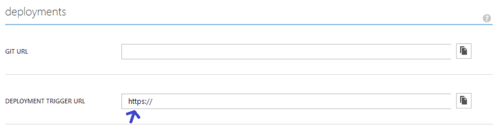

## Windows Azure Websites online tools you should know about ##

Your Windows Azure Website has some useful online tools you can use, to get them you need to access a site that accompanies every Windows Azure Website.

To get to that site you can simply browse using your favorite internet browser to [https://{site name}.scm.azurewebsites.net](), you will be asked for credentials and those will be the same as your deployment credentials, if you don't have deployment credentials you can set them up by clicking on the following link in the Azure portal, on your site's dashboard to the right:

Once you enter the right credentials, you reach the **kudu** dashboard of your site, previously this was only used for the **git deployment** feature of WAWS, now it contains several tools you can use to manage, monitor and debug your site.

> **NOTE:** Kudu is actually an open-source project and you can see it's sources on [GitHub](https://github.com/projectkudu/kudu) including some more [wikis](https://github.com/projectkudu/kudu/wiki) and the opportunity to open issues on bugs or new features you want to see.

### Dashboard Home ###

Here you can see the current build version (of kudu) and get links to all of the tools we'll discuss:

At the top you'll see links to the different tool pages, and under **REST API** you'll get links to kudu's rest apis it exposes.

> **NOTE:** Since the return value for the rest apis is in json, you can use an add-on tool such as [JSONView](https://chrome.google.com/webstore/detail/jsonview/chklaanhfefbnpoihckbnefhakgolnmc?hl=en) for Chrome which can let you browse through them easily.

### Environment ###

This page can help you see what your website sees in term of the current environment it's running on, including: general system information, app settings, environment variables, path, http headers and server variables.

> **NOTE:** While there is a "connections strings" section, it may not be exactly what your site sees as connection strings.

### Debug Console ###

This is the creme of the crop in term of useful tools, this page actually contains 2 useful tools:

1. File explorer to your site, where you can view your site's content, download files (or directories as zip), delete files (or directories), edit files and even upload files using drag and drop.

2. Remote terminal to your site, here you can run commands that will run on your site in a cmd.exe process, try it out with simple "dir" / "cd" commands or even "git clean" / "npm/nuget install", here you can experiment in what the sandbox (inside which your website is running) will let / not let you do.

> Notice that the "current directory" is synced between the file explorer and the terminal for ease of use.

### Diagnostics dump ###

This link will generate a zip file containing some of your site's logs to help investigate issues, we may request this from you on some issue scenarios when using kudu's different tools (and deployment options like: git, dropbox, ...).

### Log stream ###

Selecting this option, will at first seem like it didn't do anything, but in fact it starts a listener on your **LogFiles** directory, so any logs written there will show up (after some buffering, so the first log lines may not show up until the buffer is filled).

> **NOTE:** Clicking this link will also enable your **application logs** persistence to file system (in Error mode), if not already enabled, for a period of 12 hours (this can be turned off from the Azure portal).

### Final Note ###

If you have source control deployment setup on your site there is a simpler way to get to your **scm** site:

In the Azure portal go to your website, click on the CONFIGURE tab and under the git section copy the url which is under the DEPLOYMENT TRIGGER URL

This url has site specific credentials for your **scm** sites embedded into it so you can simply paste this URL to an internet browser that can accept this type of URLs (for example: chrome) and you'll get straight to your **scm** home page (without the need to remember your deployment credentials).
